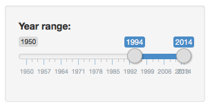
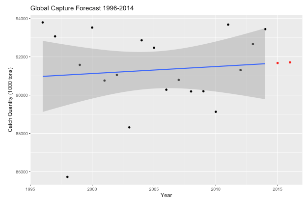

Global Capture forecast
========================================================
author: Thomas Berger
date: Jan 30, 2017
width: 1440
height: 900

Introduction
========================================================

FAO Global catch contains capture production statistics by country or territory, for the reporting year 2014; the most recent year for which data is available.

Presentation <https://bergertom.github.io/ShinyApp/> 

GIT repo <https://github.com/bergertom/ShinyApp>.

The data was loaded from the FAO query panel: <http://www.fao.org/fishery/statistics/global-capture-production/query/en>, and saved into a CSV file for this report. Data downloaded 17/01/2017.

To export, select country [Alphabetical], Index [All] to have all countries, click [select all]. Under time, select [2014] as year. Under Species, select [Ybk main groups], select [Fish, crustaceans and molluscs, etc.] to have data for human consumption.

Selecting the year range
========================================================

The slider is used to slect the year range (from-year) (to-year), for which the catch data is presented.

<a href="http://www.fao.org">FAO</a> Data is availbale from 1950 to 2014.

If the last year is set to 2014, then the graph will also show predicted data points for 2015 and 2016 using linear regression.

Graph explanation
========================================================
 

- FAO data shown as dots (1000 tons)
- Blue regression line, with 95% confidence interval
- Red dots show predicted (imputed using lm) catch for 2015 and 2016

 
The chart title shows the years selected in the slider.

<h2>Conclusion</h2>
What is noticeable, is that the claims about
the fish global stock collapsing are not true:

 
As you will observe, the data shows that global catch - apart
from normal annual fluctuations - is not declining. For the most part,
the regression line points is flat, or points slightly upwards.
This indicates a annual increase in  global fish production.

Graph
========================================================

